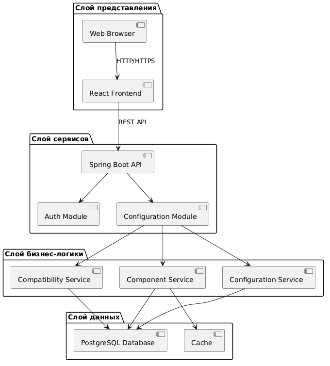

## 1. Проектируемая архитектура (To Be)

На этапе проектирования архитектуры закладываются основные принципы, обеспечивающие расширяемость, производительность и удобство сопровождения системы.

* **Тип приложения:** REST веб-приложение с клиент-серверной архитектурой. Пользователь взаимодействует с системой через веб-интерфейс, который отправляет запросы к серверной части. Основная бизнес-логика, включая обработку данных и проверку совместимости компонентов ПК, реализуется на стороне сервера.

* **Стратегия развертывания:** Client–Server Deployment. Клиентская часть приложения (React) развёртывается как веб-интерфейс и работает в браузере пользователя. Серверная часть реализована на **Java Spring Boot** и предоставляет REST API для обработки запросов. База данных **PostgreSQL** размещается на отдельном сервере и используется для хранения информации о комплектующих и конфигурациях ПК.

* **Обоснование технологий:**
  * *Java + Spring Boot:* используются для реализации серверной части благодаря удобству разработки REST API, встроенной поддержке внедрения зависимостей и развитой экосистеме.
  * *React:* выбран для реализации пользовательского интерфейса благодаря компонентной архитектуре и высокой производительности.
  * *PostgreSQL:* используется как надежная система управления базами данных, обеспечивающая целостность и устойчивое хранение информации.

* **Показатели качества:**
  * *Масштабируемость (Scalability):* архитектура позволяет увеличивать нагрузку за счет расширения серверной части.
  * *Поддерживаемость (Maintainability):* разделение системы на уровни упрощает развитие и сопровождение проекта.
  * *Надежность (Reliability):* серверная логика централизована, что обеспечивает корректную обработку данных и ошибок.

* **Сквозная функциональность:**
  * *Логирование:* используется для отслеживания работы системы и выявления ошибок.
  * *Валидация данных:* обеспечивает корректность входных данных при обработке запросов.
  * *Обработка исключений:* централизованный механизм обработки ошибок на серверной стороне.

### Структурная схема (Функциональные блоки)

Архитектура приложения построена на основе многослойной модели и включает несколько основных уровней:

1. **Presentation Layer:** веб-интерфейс пользователя, реализованный на React.
2. **Application Layer:** REST-контроллеры Spring Boot, принимающие и обрабатывающие HTTP-запросы.
3. **Business Logic Layer:** сервисы, реализующие логику работы системы и проверку совместимости компонентов.
4. **Data Layer:** репозитории доступа к данным и база данных PostgreSQL.

*Рисунок 1. Архитектура проектируемой системы (To Be)*
